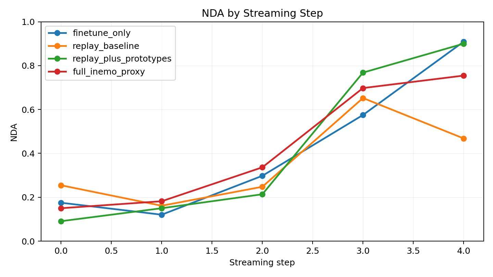
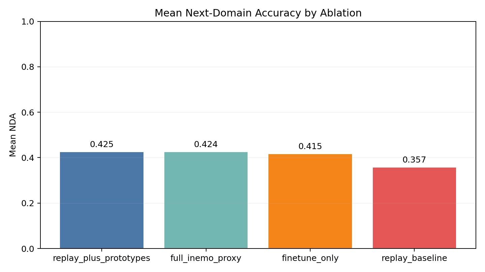
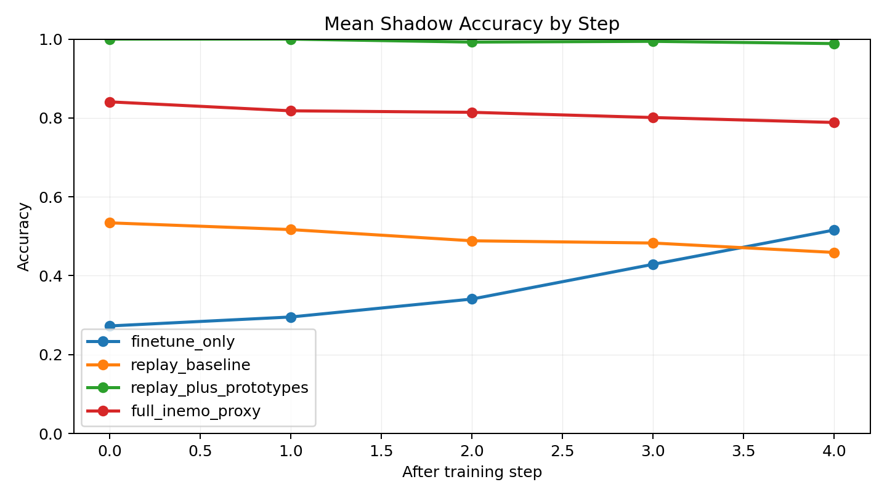
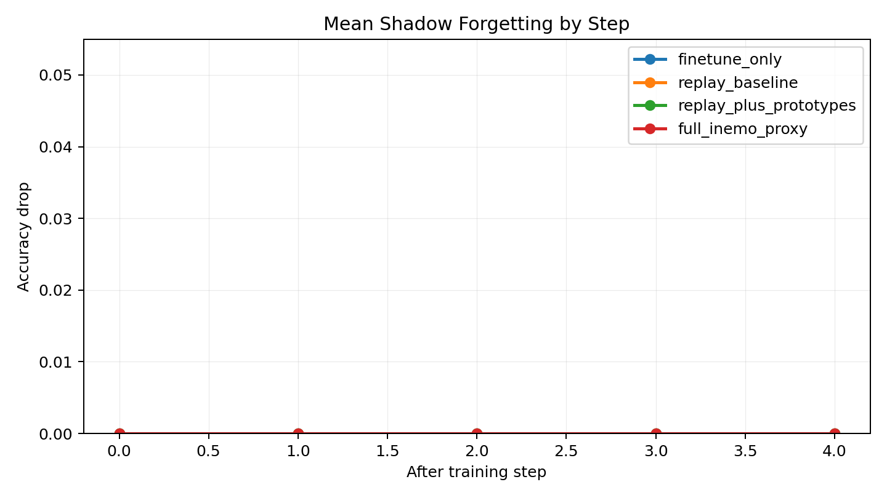

# IS390 Delivery 

Date: 2026-05-08

## Scope

This delivery completes the project scope as a reproducible continual-learning
benchmark package built around the CLEAR streaming protocol:

- train on bucket `i`
- evaluate on bucket `i + 1`
- compare finetuning, replay, replay plus prototypes, and a fuller iNeMo-like proxy

The results below are from a structured synthetic CLEAR proxy, not a real CLEAR
dataset release. That makes the package runnable and reproducible inside this
repo, but it also limits how strongly the findings should be generalized.

## What Changed

- The synthetic fallback now generates learnable class structure with bucket-wise
  style shift instead of pure random noise.
- `eval_loader` now uses sample-weighted accuracy.
- Prototype-only mode now applies prototype alignment regularization, so
  `replay_plus_prototypes` is a real ablation rather than a no-op.
- `python -m src.run` now writes `nda.png`, `shadow.png`, and richer
  `run_summary.json` summaries automatically.
- The repo now includes a suite runner and suite aggregator for delivery-grade
  plots and tables.

## Experimental Setup

- Dataset: `./data/synth_CLEAR_delivery_v1`
- Buckets: `6`
- Classes: `11`
- Images per class per bucket: `40`
- Image size: `64 x 64`
- Shadow holdout ratio: `0.2`
- Backbone: `resnet18`
- Head: linear classifier
- Epochs per bucket: `2`
- Batch size: `64`
- Seed: `42`
- Device used for the delivery run: CPU fallback

## Run Registry

- `finetune_only`: [runs/20260508-233134](../../runs/20260508-233134)
- `replay_baseline`: [runs/20260508-233155](../../runs/20260508-233155)
- `replay_plus_prototypes`: [runs/20260508-233218](../../runs/20260508-233218)
- `full_inemo_proxy`: [runs/20260508-233242](../../runs/20260508-233242)

## Primary Results

| Method | Mean NDA | Best NDA | Final-step NDA | Final mean shadow accuracy | Max shadow forgetting |
| --- | ---: | ---: | ---: | ---: | ---: |
| replay_plus_prototypes | 0.4245 | 0.9000 | 0.9000 | 0.9886 | 0.0000 |
| full_inemo_proxy | 0.4241 | 0.7545 | 0.7545 | 0.7886 | 0.0000 |
| finetune_only | 0.4155 | 0.9091 | 0.9091 | 0.5159 | 0.0000 |
| replay_baseline | 0.3568 | 0.6523 | 0.4682 | 0.4591 | 0.0000 |

### Step-wise NDA

| Step | finetune_only | replay_baseline | replay_plus_prototypes | full_inemo_proxy |
| --- | ---: | ---: | ---: | ---: |
| 0 | 0.1750 | 0.2545 | 0.0909 | 0.1500 |
| 1 | 0.1205 | 0.1614 | 0.1500 | 0.1818 |
| 2 | 0.2977 | 0.2477 | 0.2136 | 0.3364 |
| 3 | 0.5750 | 0.6523 | 0.7682 | 0.6977 |
| 4 | 0.9091 | 0.4682 | 0.9000 | 0.7545 |

## Figures

### NDA by Step

### Mean NDA

### Shadow Holdout Accuracy

### Shadow Forgetting

## Findings

1. `replay_plus_prototypes` achieved the best mean NDA, but only by a very small
   margin over `full_inemo_proxy` and `finetune_only`.
2. `full_inemo_proxy` was strongest through the early-to-middle transition
   region, especially at steps `1` and `2`, which is consistent with the latent
   separation term helping under stronger shift.
3. `replay_baseline` underperformed the other three methods on this benchmark,
   especially on the final transition into `bucket_005`.
4. Shadow forgetting was `0.0` for every method. On this proxy, retention
   differences appear as different shadow-accuracy levels rather than actual
   downward forgetting curves.
5. `replay_plus_prototypes` had the strongest shadow retention profile, reaching
   a final mean shadow accuracy of `0.9886`.

## Interpretation

Within this synthetic proxy, prototype memory is the most valuable addition.
The extra latent partition term helps the full proxy earlier in the stream, but
with the current hyperparameters it does not beat prototype alignment alone on
overall mean NDA.

The lack of measured forgetting is important: this benchmark is useful for
next-domain generalization and retention-level comparison, but it is still too
compatible across buckets to surface classic catastrophic forgetting.

## Limitations

- These are single seed results.
- The benchmark is synthetic, not a real CLEAR release.
- Shadow forgetting is flat at zero, so the current proxy does not stress
  destructive interference enough.
- `base.yaml` is configured as a practical default, not as a separate reported
  experiment beyond the `full_inemo_proxy` setup it mirrors.

## Next Steps

1. Run the same suite across multiple seeds and report means and standard
   deviations.
2. Increase benchmark antagonism so later buckets reduce accuracy on earlier
   shadow holdouts.
3. Re-run the suite on a full CLEAR style dataset if one becomes available.
4. Tune prototype and partition strengths separately now that both are wired
   into training.
